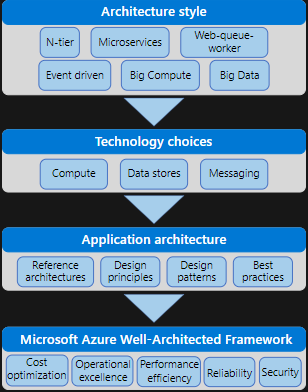

# Azure Application Architecture Guide

## Introduction
- Applications are decomposed into smaller, decentralized services.
- Services communicate through APIs or by using asynchronous messaging or eventing.
- Applications scale horizontally, adding new instances as demand requires.
- Application state is distributed.
- Operations are done in parallel and asynchronously.
- Applications must be resilient when failures occur.
- Deployments must be automated and predictable.
- Monitoring and telemetry are critical for gaining insight into the system.

#### Traditional on-premises
- Monolithic
- Designed for predictable salability
- Relational database
- Synchronized processing
- Design to avoid failures : Mean time between failures (MTBF) - It is a measure of how reliable a hardware product or componenet is.
- Occasional large updates
- Manual management
- Snowflake servers

#### Modern cloud
- Decomposed
- Designed for elastic scale
- Polyglot presistence (mix of storage technologies)
- Asynchronous processing
- Design of failure : Mean time to repair (MTTR) - It is a basic measure of the maintainability of repairable items.It represents the average time required to repair a failed component or device.
- Frequent small updates
- Automated self-management
- Immutable infrastructure

## Workflow to a well architectured cloud application

#### [Architecture styles](https://github.com/naveenraman/AzureApplicationArchitectureGuide/blob/master/2_ArchitectureStyles.md#architecture-styles)
What kind of architecture we are building? Like microservice architecture, N-tier application or a big data solution

#### Technology choices
After knowing the architecture, now we need to choose the main technology pieces for the architecture.
Here are the following technology choices are critical:
  1. Compute: It refers to the hosting model for the computing resources that our applications run on.
  2. Data stores: It includes databases but also storage for message queues, caches, logs, and anything else that an application might persist to storage.
  3. Messaging: This technologies enable asynchronous messages between components of the system.

#### Design the architecure
After we have chosen the architecture style and the major technology components, now we need to tackle the specific design of your application.

##### Reference architectures
- Recommended practices, along with considerations for scalability, availability, security, resilience and other respects of the design.
- It should also include a deployable solution of reference implementation.

##### Design principles
There are 10 high-level design principles that will make our application more scalable, resilient, and manageable.

##### Design patterns
These patterns are repeatable patterns that are proven to solve specific problems. These patterns address aspects such as availability, resiliency, performance and security.

##### Best practices
This would cover various design considerations including API design, autoscaling, data partitioning, caching, and so forth.

#### Microsoft Azure Well-Architected Framework (Quality pillars)
A successful cloud application will focus on 5 pillars of software quality:
  - Cost optimization
  - Operational excellence
  - Performance efficiency
  - Reliability
  - Security
